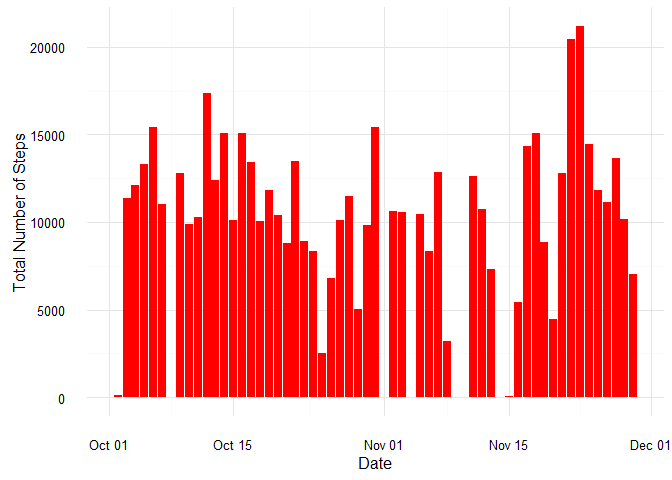
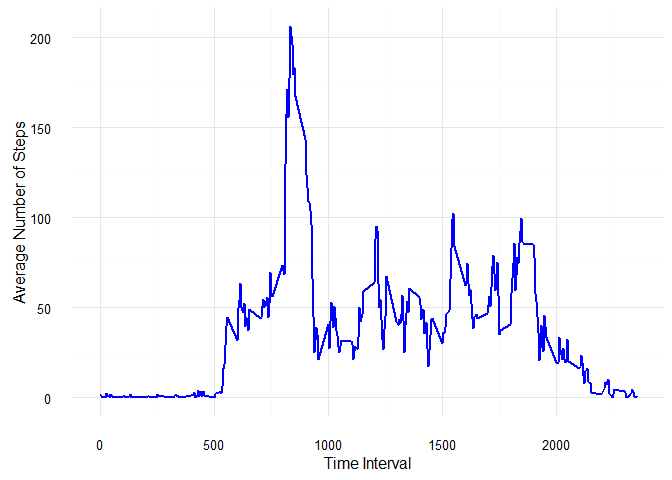
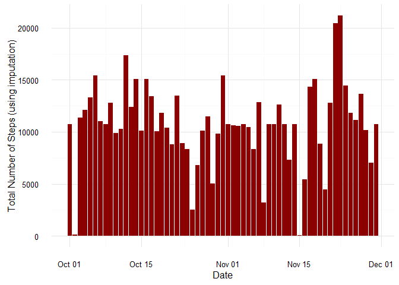
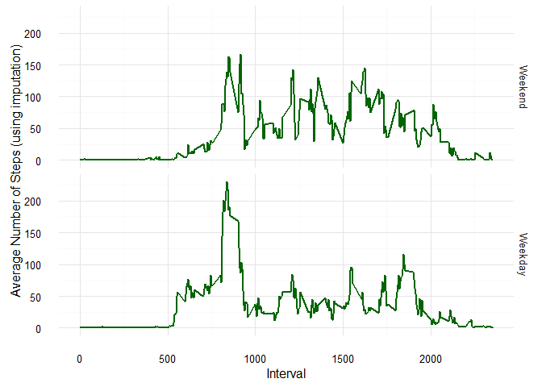

# Reproducible Research: Peer Assessment 1


## **Loading and preprocessing the data.**


```r
# load and/or install packages
used.packages <- c("data.table", "dplyr", "lubridate", "ggplot2")
new.packages <- used.packages[!(used.packages %in% installed.packages()[,"Package"])]
if(length(new.packages)>0) {install.packages(new.packages)} 
invisible(lapply(used.packages, require, character.only = TRUE))

# unzip file and read into data.table
if(!(file.exists("activity.csv"))) {
      unzip("activity.zip")
}
data <- fread("activity.csv", sep = ",", nrows = -1)

# convert date from character to POSIXct 
data$date <- ymd(data$date)
```

## **What is mean total number of steps taken per day?**
### Make a histogram of the total number of steps taken each day. 

```r
# calculate and plot total steps per day, 
# (Yes, this is a histogram.)
ggplot(data, aes(x = date, y = steps)) +
      stat_summary(fun.y="sum", geom = "bar", na.rm = TRUE, fill = "red") +
      ylab("Total Number of Steps") +
      xlab("Date")+ 
      theme_minimal()
```



### Calculate and report the **mean** of the total number of steps taken per day.

```r
# calculate the mean steps per day
data %>%
      group_by(date) %>%
      summarise(day_sum = sum(steps, na.rm = TRUE)) %>%
      summarise(mean_day_sum = mean(day_sum))
```

```
## Source: local data table [1 x 1]
## 
##   mean_day_sum
##          (dbl)
## 1      9354.23
```

### Calculate and report the **median** of the total number of steps taken per day.

```r
# calculate the median steps per day
data %>%
      group_by(date) %>%
      summarise(day_sum = sum(steps, na.rm = TRUE)) %>%
      summarise(median_day_sum = median(day_sum))
```

```
## Source: local data table [1 x 1]
## 
##   median_day_sum
##            (int)
## 1          10395
```

## **What is the average daily activity pattern?**
### Make a time series plot of the 5-minute interval (x-axis) and the average number of steps taken, averaged across all days (y-axis).

```r
# summarise and plot the total steps per time interval
ggplot(data, aes(x = interval, y = steps)) +
      stat_summary(fun.y = "mean", geom = "path", na.rm = TRUE,
                   color = "blue", size = 0.75) +
      theme_minimal() +
      ylab("Average Number of Steps") +
      xlab("Time Interval")
```



### Which 5-minute interval, on average across all the days in the dataset, contains the maximum number of steps?

```r
# find the interval with most average steps
data %>%
      group_by(interval) %>%
      summarise(mean_interval = mean(steps, na.rm = TRUE)) %>%
      arrange(desc(mean_interval)) %>%
      select(interval) %>%
      slice(1)
```

```
## Source: local data table [1 x 1]
## 
##   interval
##      (int)
## 1      835
```

## **Imputing missing values**
### Calculate and report the total number of missing values in the dataset (i.e. the total number of rows with NAs).

```r
# number of NA values
sum(is.na(data$steps))
```

```
## [1] 2304
```

### Impute and make a histogram of the total number of steps taken each day.

```r
# make table of mean interval values for imputation ("the mean for that 5-minute interval")
mean_interval_table <- data %>%
      group_by(interval) %>%
      summarise(mean_interval = mean(steps, na.rm = TRUE))

# join original dataset with imputation values  
data <- inner_join(data, mean_interval_table)

# reorder the dataset (back to original order)
data <- data[order(date, interval)]

# preform the imputation for all NA values
data$steps_imputed <- ifelse(is.na(data$steps), data$mean_interval, data$steps)

# calculate and plot the total number of steps per day, with imputation
# (Yes, this is a histogram.)
ggplot(data, aes(x = date, y = steps_imputed)) +
      stat_summary(fun.y="sum", geom = "bar", fill = "darkred") +
      theme_minimal() +
      ylab("Total Number of Steps (using imputation)") +
      xlab("Date") 
```



### Calculate and report the **mean** total number of steps taken per day.

```r
# average steps per day
data %>%
      group_by(date) %>%
      summarise(sum_day_imputed = sum(steps_imputed, na.rm = FALSE)) %>%
      summarise(mean_sum_day_imputed = mean(sum_day_imputed))
```

```
## Source: local data table [1 x 1]
## 
##   mean_sum_day_imputed
##                  (dbl)
## 1             10766.19
```

### Calculate and report the **median** total number of steps taken per day. 

```r
# median steps per day
data %>%
      group_by(date) %>%
      summarise(sum_day_imputed = sum(steps_imputed, na.rm = FALSE)) %>%
      summarise(median_sum_day_imputed = median(sum_day_imputed))
```

```
## Source: local data table [1 x 1]
## 
##   median_sum_day_imputed
##                    (dbl)
## 1               10766.19
```
###  Do these values differ from the estimates from the first part of the assignment? What is the impact of imputing missing data on the estimates of the total daily number of steps?
Yes, both the mean and the median values for the total daily number of steps **increase** after imputation.

## **Are there differences in activity patterns between weekdays and weekends?**
### Make a panel plot containing a time series plot of the 5-minute interval (x-axis) and the average number of steps taken, averaged across all weekday days or weekend days (y-axis). 

```r
# create new variable in dataset, "day_type" as factor
data$day_type <- as.factor(ifelse(weekdays(data$date) == "Saturday" |
                        weekdays(data$date) == "Sunday", 
                        "Weekend", "Weekday"))

# relevel the factors with "Weekend" first
data$day_type <- relevel(data$day_type, "Weekend")

# plot average number of steps (using imputation) vs interval
ggplot(data, aes(x = interval, y = steps_imputed)) +
      facet_grid(day_type ~ .) +
      stat_summary(fun.y="mean", geom = "path",
                   color = "darkgreen", size = 0.75) +
      theme_minimal() +
      ylab("Average Number of Steps (using imputation)") +
      xlab("Interval") 
```



